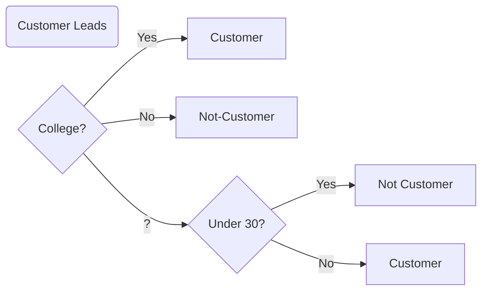

### Our Data

| Attended College | Under Thirty | Borough   | Income | Customer |
| ---------------- | ------------ | --------- | ------ | :------: |
| ?                | Yes          | Manhattan | < 55   |    0     |
| Yes              | Yes          | Brooklyn  | < 55   |    0     |
| ?                | No           | Brooklyn  | < 55   |    1     |
| No               | No           | Queens    | > 55   |    1     |
| ?                | No           | Queens    | < 55   |    1     |
| Yes              | No           | Queens    | >55    |    0     |
| Yes              | No           | Queens    | >55    |    0     |
| Yes              | Yes          | Manhattan | >55    |    0     |

### The answer

Let's just see the criteria.  And then later we'll learn how we got there.  This is the answer.




Making a prediction

| Attended College | Under Thirty | Borough   | Income |
| ---------------- | ------------ | --------- | ------ |
| ?                | No           | Manhattan | < 55   |

### Defining our decision tree


**node** 

**edge**

 **leaf node**

 **depth**

### Decision Trees: Another view 


```python
if customer['college'] == True:
  return 1
elif customer['college'] == False:
  return 0
else:
  if customer['under_thirty']:
    return 0
  else:
    return 1
```

