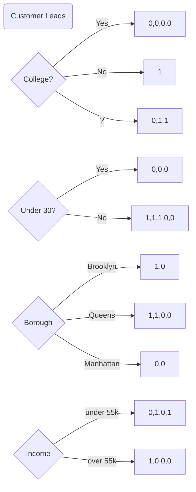
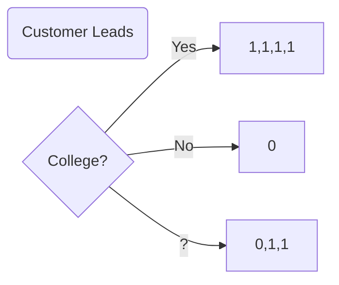
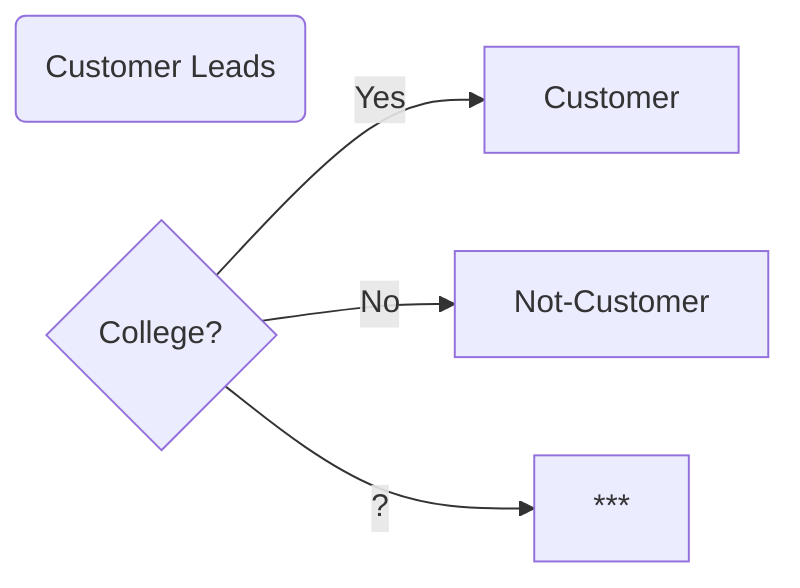
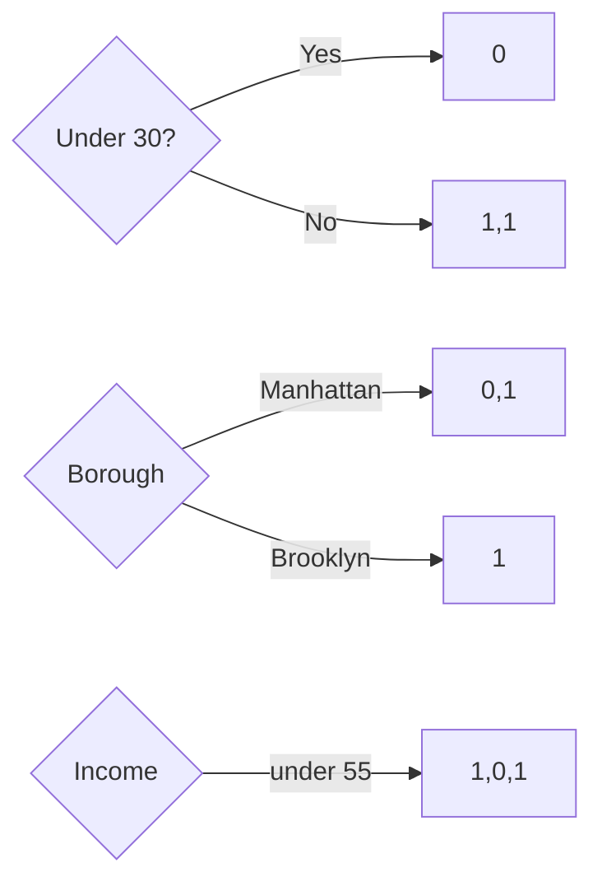
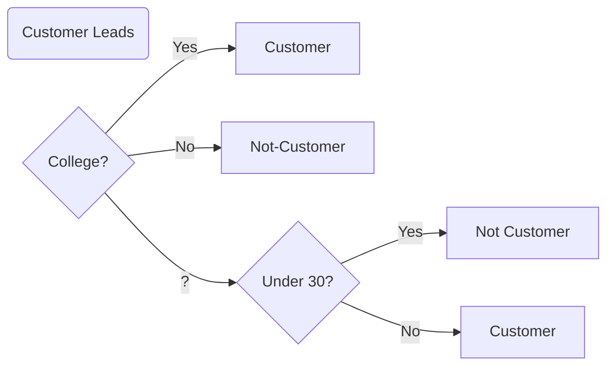

### Our Data

| Attended College | Under Thirty | Borough   | Income | Customer |
| ---------------- | ------------ | --------- | ------ | :------: |
| ?                | Yes          | Manhattan | < 55   |    0     |
| Yes              | Yes          | Brooklyn  | < 55   |    0     |
| ?                | No           | Brooklyn  | < 55   |    1     |
| No               | No           | Queens    | > 55   |    1     |
| ?                | No           | Queens    | < 55   |    1     |
| Yes              | No           | Queens    | >55    |    0     |
| Yes              | No           | Queens    | >55    |    0     |
| Yes              | Yes          | Manhattan | >55    |    0     |

#### Our Procedure

```
Given a subset of data
For each feature in our dataset
	○ Split the data according to the feature
	○ Compute consistency of data in each split 
Choose the feature with the highest consistency to split the data
Repeat for remaining subset
```


#### 1. Split the data according to each feature


```
Given a subset of data
For each feature in our dataset
	○ Split the data according to the feature
	○ Compute consistency of data in each split 
```

Each of the tests




#### 2. Compute consistency of data in each split 


#### 3. Choose the feature with the highest consistency 





And turned it into this.



#### 4. Repeat for remaining subset


| Attended College | Under Thirty | Borough   | Income | Customer | Customer Predictions |
| ---------------- | ------------ | --------- | ------ | :------: | -------------------- |
| ?                | Yes          | Manhattan | < 55   |    0     | ?                    |
| Yes              | Yes          | Brooklyn  | < 55   |    0     | 1                    |
| ?                | No           | Brooklyn  | < 55   |    1     | ?                    |
| No               | No           | Queens    | > 55   |    1     | 0                    |
| ?                | No           | Queens    | < 55   |    1     | ?                    |
| Yes              | No           | Queens    | >55    |    0     | 1                    |
| Yes              | No           | Queens    | >55    |    0     | 1                    |
| Yes              | Yes          | Manhattan | >55    |    0     | 1                    |

Scoped down to this

| Attended College | Under Thirty | Borough   | Income | Customer | Customer Predictions |
| ---------------- | ------------ | --------- | ------ | :------: | -------------------- |
| ?                | Yes          | Manhattan | < 55   |    0     | ?                    |
| ?                | No           | Brooklyn  | < 55   |    1     | ?                    |
| ?                | No           | Manhattan | < 55   |    1     | ?                    |

Remember our procedure.

```
Given a subset of data
For each feature in our dataset
	○ Split the data according to the feature
	○ Compute consistency of data in each split 
Choose the feature with the highest consistency to split the data
Repeat for remaining subset
```




Add to decision tree




Predicting new data

| Attended College | Under Thirty | Borough   | Income |
| ---------------- | ------------ | --------- | ------ |
| ?                | No           | Manhattan | < 55   |

### Working with larger datasets

1. How can we count only the data in homogenous groups if no group is homogenous

2. How do we make predictions with data that is not perfectly homogenous

